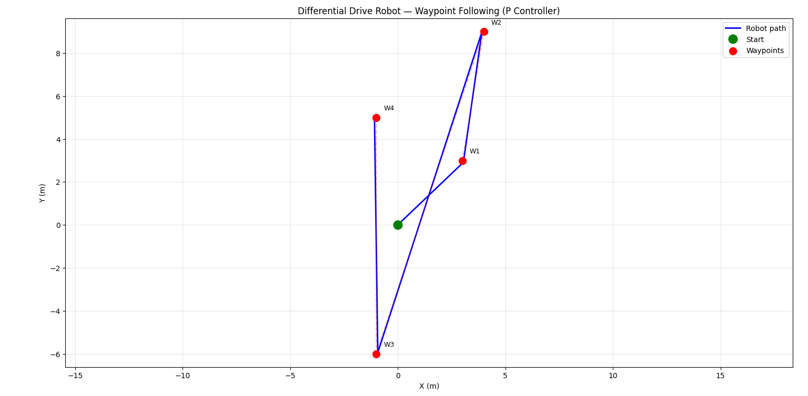

# robot-waypoint-controller

# Differential Drive Robot — Waypoint Following

A Python simulation of a differential drive robot navigating through user-defined waypoints using a Proportional (P) controller.

## Demo


## How It Works
- The robot takes a list of (x, y) waypoints as input
- A P controller computes linear and angular velocity at each step
- The robot turns to face the goal before moving forward
- The trajectory is plotted using matplotlib

## Usage
```bash
python 2drobot3.py
```
Enter waypoints when prompted (e.g. `5 5`), type `done` when finished.

## Parameters
| Parameter | Value | Description |
|-----------|-------|-------------|
| kp_d | 2 | Proportional gain for distance |
| kp_theta | 2 | Proportional gain for angle |
| vmax | 10 | Max linear velocity |
| wmax | 10 | Max angular velocity |
| dt | 0.1 | Time step (s) |

## Requirements
- Python 3.x
- matplotlib

## Future Improvements
- obstacle avoidance
- PID controller
- Animated trajectory
- Noise simulation
